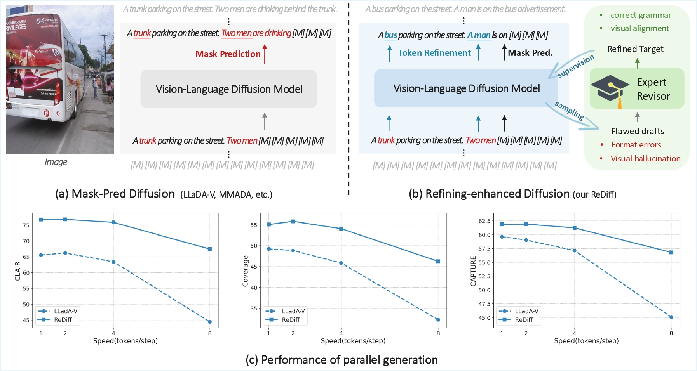

# From Denoising to Refining: A Corrective Framework for Vision-Language Diffusion Model
[](https://arxiv.org/)
[](https://huggingface.co/jiyatai/ReDiff)

  
## Introduction
 We introduce ReDiff, a refining-enhanced vision-language diffusion model.




### Quick Inference Demo
The [ReDiff model](https://huggingface.co/jiyatai/ReDiff) is now available on Hugging Face Hub. To quickly test the model with a visual instruction demo, follow these simple steps:

1. **Clone the repository**  
   ```bash
   git clone https://github.com/jiyt17/ReDiff
   cd train
   ```
2. **Initialize the environment**  
   Run the environment setup script to install necessary dependencies:
   ```bash
   bash init_env.sh
   ```
3. **Run the demo script**  
   Execute the demo script to test ReDiff on an example image:
   ```bash
   python generate_demo.py
   ```

## Training
Our model is trained from [LLaDA-V](https://github.com/ML-GSAI/LLaDA-V).

### Foundational revision training
We train model to revise two types of synthetic errors: syntactic errors and semantic hallucinations. 

The syntactic errors are injected by randomly replacing a fraction of tokens with other tokens from the vocabulary, and semantic hallucinations are from ViCrit dataset, which provides pairs of correct captions and captions with factual errors.

1. Training data preparation:...

2. Training script:
   ```bash
   cd train
   bash ./scripts/llada_v_finetune_vicrit.sh
   ```

### Online self-correction learning

1. Data praparation with o4-mini.
   ```bash
   cd train/data_pipe
   bash inference.sh
   python data_pipeline_gpt.py
   python process.py
   ```

2. Training script:
   ```bash
   cd train
   bash ./scripts/llada_v_finetune_o4.sh
   ```


## Evaluation
We tend to improve the generation quality of vision-language diffusion model, and demonstrate the effectiveness of refining-enhanced diffusion framework on three detailed image caption benchmarks: CapMAS (3 metrics: CLAIR for overall caption quality, Coverage for the comprehensiveness of the description, and Factuality for the accuracy of the content), CapArena (score based on pairwise comparison) and DetailCaps-4870 (metric: CAPTURE).

Evaluation script:
   ```bash
   cd eval
   bash inference.sh
   ```


## Acknowledgments
The code is largely based on the [LLaDA-V](https://github.com/ML-GSAI/LLaDA-V), training data source contains [ViCrit](https://huggingface.co/datasets/zyang39/ViCrit-Train), [LLaVA-OneVision](https://huggingface.co/datasets/lmms-lab/LLaVA-OneVision-Data). We thank the authors for their great work.

## Citation


